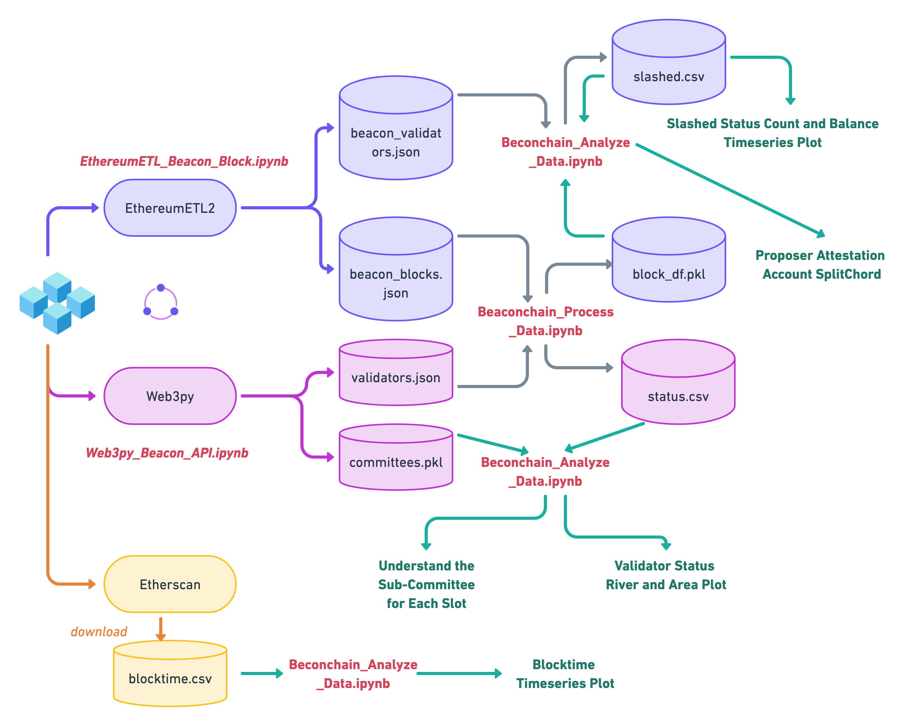
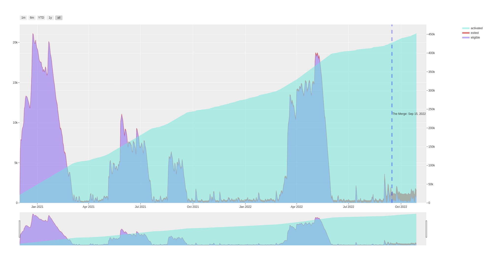
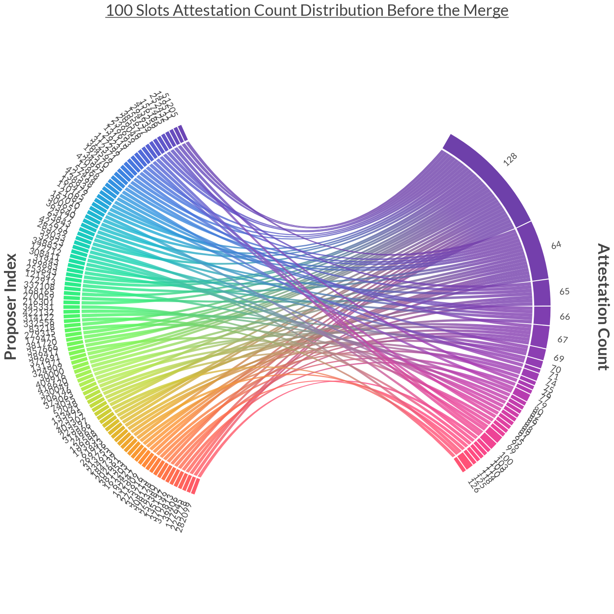

# The Beacon Chain Dynamics at Merge: Validator Life Cycle Visualizations

## The Data Science Pipeline

## How to run code?

All the codes are stored in the [code](https://github.com/sunshineluyao/ethereum-beaconchain/tree/master/code) folder as Jupyter notebooks, which can be run directly by opening in Google Colab. 

- [optional] Courtesy Note 1: If you want to check the replicability of our queried data directly from the source or update the data to a new time range, you must get an end-points URL from a node provider such as [QuickNode](https://ms.pubpub.org/pub/computing).
- [optional] Courtesy Note 2: If you want to check the replicability of exporting our figures produced visa plotAPI in PDF and PNG formats, you must get a business license from [PlotAPI](https://plotapi.com/).
- [optional] Courtesy Note 3: If you want to check the replicability of importing large data files into the Google Colab, you must run the code under the runtime type: High-RAM in [Google Colab](https://colab.research.google.com/). 

## Data
All the queried and processed data are stored in the [data](https://github.com/sunshineluyao/ethereum-beaconchain/tree/master/data) folder and you can find the data description file in the [Readme](https://github.com/sunshineluyao/ethereum-beaconchain/blob/master/data/Readme.md).

## Spotlight

### Product 1: Validator Status Theme River Plot

### Product 2: Validator Status Area Plot

### Product 3: Attestation Count SplitChord Plot Before and After the Merge

